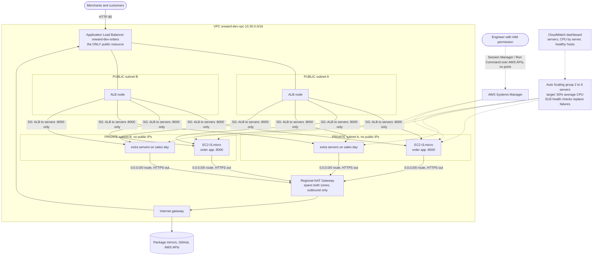
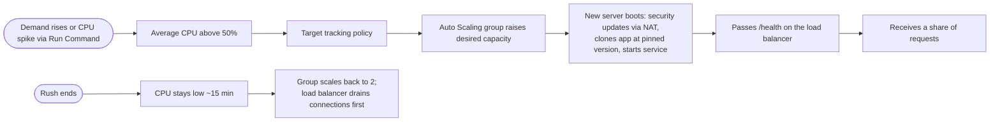
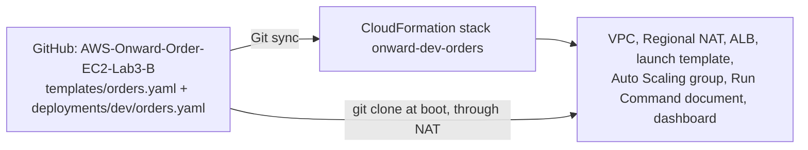

# Onward sales-day order system: architecture

## Inside the VPC (eu-west-1, two Availability Zones)

```mermaid
flowchart TB
  users([Merchants and customers]) -->|HTTP 80| alb
  admin([Engineer with IAM permission]) -.->|Session Manager / Run Command over AWS APIs, no ports| ssm[AWS Systems Manager]

  subgraph vpc["VPC onward-dev-vpc 10.30.0.0/16"]
    igw[Internet gateway]
    subgraph pubA["PUBLIC subnet A"]
      albA[ALB node]
    end
    subgraph pubB["PUBLIC subnet B"]
      albB[ALB node]
    end
    alb["Application Load Balancer onward-dev-orders<br/>the ONLY public resource"]
    subgraph privA["PRIVATE subnet A, no public IPs"]
      s1["EC2 t3.micro<br/>order app :8000"]
      s3["extra servers on sales day"]
    end
    subgraph privB["PRIVATE subnet B, no public IPs"]
      s2["EC2 t3.micro<br/>order app :8000"]
      s4["extra servers on sales day"]
    end
    nat["Regional NAT Gateway<br/>spans both zones, outbound only"]
  end

  alb --- albA & albB
  igw --> alb
  albA & albB -->|SG: ALB to servers :8000 only| s1 & s2 & s3 & s4
  s1 & s2 & s3 & s4 -->|0.0.0.0/0 route, HTTPS out| nat
  nat --> igw
  igw --> internet[(Package mirrors, GitHub, AWS APIs)]
  ssm -.-> s1 & s2
  asg["Auto Scaling group 2 to 6 servers<br/>target: 50% average CPU<br/>ELB health checks replace failures"] -.-> s1 & s2 & s3 & s4
  cw["CloudWatch dashboard<br/>servers, CPU by server, healthy hosts"] -.-> asg
```

## How a sales-day surge is handled

```mermaid
flowchart LR
  load([Demand rises or CPU spike via Run Command]) --> cpu["Average CPU above 50%"]
  cpu --> tt["Target tracking policy"] --> asg["Auto Scaling group raises desired capacity"]
  asg --> boot["New server boots: security updates via NAT,<br/>clones app at pinned version, starts service"]
  boot --> hc["Passes /health on the load balancer"] --> serve["Receives a share of requests"]
  quiet([Rush ends]) --> low["CPU stays low ~15 min"] --> shrink["Group scales back to 2;<br/>load balancer drains connections first"]
```

## How the setup gets built

```mermaid
flowchart LR
  git["GitHub: AWS-Onward-Order-EC2-Lab3-B<br/>templates/orders.yaml + deployments/dev/orders.yaml"] -->|Git sync| cfn["CloudFormation stack onward-dev-orders"]
  cfn --> res["VPC, Regional NAT, ALB, launch template,<br/>Auto Scaling group, Run Command document, dashboard"]
  git -->|git clone at boot, through NAT| res
```
